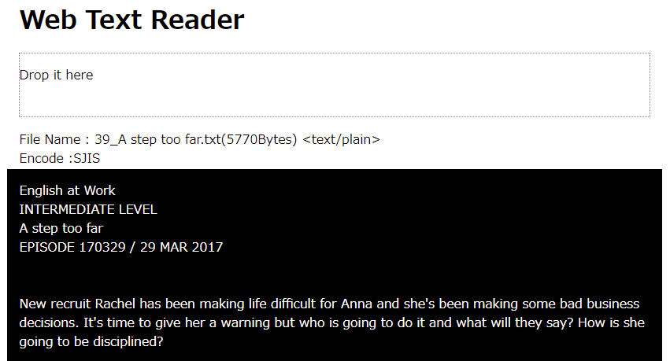

# Web Test Reader

## About Web Test Reader

* Drag and drop the text file to display it in your browser
* I made this so that I can search the text file in the Mouse Dictionary of the browser extension.
* Supports Japanese character code text (UTF16, UTF8, EUCJP, SJIS etc)
* I refer to the following site. (https://note.affi-sapo-sv.com/js-dandd-text-view.php)

## Screenshot

## Using

* https://note.affi-sapo-sv.com/js-dandd-text-view.php
* encoding.js
